# Rusty CAN Studio

Complete Product & Engineering Reference

Version 1.0  |  July 13, 2026  |  Pennowtech / Rusty CAN Studio Team

| Platform | Stack | Backend | Status |
| --- | --- | --- | --- |
| Windows desktop, Linux desktop, browser preview | Tauri 2, React 19, TypeScript, Rust, Vite | can_bridge_daemon over WebSocket JSON; local storage for app state | In Development |

Internal - Not for External Distribution

## Table of Contents

01. Executive Overview
02. Functional Requirements
03. Non-Functional Requirements
04. Technical Stack
05. System Architecture
06. Use Cases - Full Catalogue
07. Sequence Diagrams
08. Database Schema & ERD
09. State Machine Diagrams
10. Screen Designs & UI/UX
11. Complete Project Setup
12. Full Implementation Guide
13. Architecture Decisions
14. Quality, Risks & Technical Debt

## 01 Executive Overview

### 1.1 Product Summary

Rusty CAN Studio is a desktop workbench for CAN and CAN-FD traffic analysis, profile-driven decoding, and controlled transmission workflows. It lets engineers load candump logs, connect to a remote SocketCAN daemon, inspect live traffic, decode protocol fields from JSON profiles, and build repeatable simulator sequences without writing a custom tool for every investigation. The primary user action is to move from raw frames to meaningful diagnosis: capture or load traffic, decode it, filter it, and optionally transmit or simulate follow-up frames. The core benefit is faster CAN-FD investigation with a generic profile system that keeps protocol knowledge outside the application code.

### 1.2 Core Value Proposition

| Pillar | Description | User Need Addressed |
| --- | --- | --- |
| Trace inspection | Load candump logs or stream live frames into one monitor table. | Engineers need to inspect raw traffic quickly without changing tools. |
| Profile-driven decoding | Decode CAN ID fields, payload headers, payload values, and error status from JSON profiles. | Raw bytes need to become meaningful fields without hardcoding one protocol. |
| Remote SocketCAN access | Connect from Windows to `can_bridge_daemon` running in Linux or WSL. | Users need access to SocketCAN interfaces that are not native on Windows. |
| Controlled transmission | Send single frames, cyclic frames, and sequence-driven workflows. | Users need to reproduce requests, poll status, and validate response behavior. |
| Analysis ergonomics | Filtering, sorting, pagination, column controls, exports, archive, themes, density, and Help. | Long traces need to stay readable and repeatable during real investigations. |

### 1.3 Goals & Success Metrics

| Priority | Goal | Metric / Target | Timeframe |
| --- | --- | --- | --- |
| P0 - Critical | Reliable trace inspection | Load and render 50k candump rows without blocking the UI for normal use | v1.0 |
| P0 - Critical | Safe profile matching | Unknown service/message frames must not borrow unrelated profile labels | v1.0 |
| P1 - High | Live capture responsiveness | Incoming live frames batch into UI updates without freezing typing/filtering | v1.0 |
| P1 - High | Quality baseline | `npm run quality:check` passes before release | Every release |
| P2 - Medium | User onboarding | User guide, examples, and Help cover log load, daemon connection, profiles, filters, TX, and simulator | v1.0 |
| P2 - Medium | Accessibility baseline | Automated accessibility check passes; manual keyboard path reviewed | v1.0 |
| P3 - Low | Browser preview compatibility | Browser baseline passes for Chrome, Edge, Firefox, and Safari targets | v1.0 |

### 1.4 Target Users & Personas

| Persona | Description | Primary Goals | Key Pain Points |
| --- | --- | --- | --- |
| CAN-FD engineer | Developer or test engineer working with CAN/CAN-FD systems, often on Windows with WSL/Linux interfaces. | Decode traffic, find errors, transmit known frames, compare traces. | Raw candump logs are hard to read, Windows lacks SocketCAN, manual decoding is slow. |
| Integration tester | Test engineer validating request/response workflows and cyclic polling behavior. | Reproduce sequences, wait for responses, export evidence. | Existing tools often handle either capture or TX, not chained workflows. |
| Profile maintainer | Engineer maintaining JSON profiles generated from XML or hand-authored specs. | Edit payload layouts, validate decode output, keep profiles generic. | Schema definitions can become duplicated, brittle, or coupled to code. |
| Support / diagnostics user | Engineer investigating failures from saved logs. | Load logs, filter errors, export decoded CSV. | Needs quick evidence without live hardware. |

### 1.5 Stakeholders

| Stakeholder | Role | Key Expectations | Communication Cadence |
| --- | --- | --- | --- |
| Product Owner | Product direction and release prioritization | Workflow completeness and usable UX for CAN-FD investigations | Weekly review |
| Engineering Lead | Architecture, quality, and delivery | Generic profile-driven code, stable transport, maintainable UI | Per milestone |
| Test / Validation Team | Real-world workflow validation | Reliable capture, decoding, TX, exports, and scenario logs | Per feature |
| Security Reviewer | Dependency, data-sharing, and daemon exposure review | Baseline audits, no accidental secrets, clear sharing warnings | Per release |
| End Users | Engineers using the tool | Fast trace inspection, clear decoded fields, reliable TX feedback | Continuous feedback |

### 1.6 Scope & Non-Scope

In Scope - v1.0:

- Load candump logs and show source line numbers.
- Connect to remote `can_bridge_daemon` over WebSocket JSON.
- Subscribe to daemon-provided SocketCAN interfaces.
- Display RX and app-originated TX frames in CAN Monitor.
- Decode frames from JSON profiles.
- Display CAN ID fields, payload headers, payload values, error status, and message names.
- Display filters, sorting, pagination for loaded logs, column visibility, and column ordering.
- Export raw candump and decoded CSV.
- Send single frames and cyclic frames.
- Build and run CAN Simulator sequences.
- Persist settings, theme, density, filters, sort presets, diagnostics, trace archive, and connection profiles.
- Provide user guide, developer guide, examples, Help, security, testing, and quality docs.

Out of Scope - Deferred:

- Direct Windows-native SocketCAN access without the daemon.
- Full native Android application.
- Full browser E2E visual regression suite.
- Full WCAG audit beyond the automated accessibility baseline.
- Authenticated multi-user cloud backend.
- Central database service.
- Protocol-specific decoding hardcoded into app logic.

Note: Non-scope is intentional. The product should remain a generic CAN/CAN-FD workbench whose protocol behavior is driven by JSON profiles and daemon capabilities.

## 02 Functional Requirements

### 2.1 CAN Monitor

| ID | Requirement | Priority | Notes |
| --- | --- | --- | --- |
| FR-01 | The system shall load candump text files into CAN Monitor. | Must | UC-01 |
| FR-02 | The system shall preserve source line numbers for loaded candump rows. | Must | Required for trace evidence. |
| FR-03 | The system shall display live RX frames from the active daemon connection. | Must | UC-02 |
| FR-04 | The system shall display app-originated TX rows in the monitor. | Must | Includes pending, sent, failed states. |
| FR-05 | The system shall keep the table header visible while scrolling. | Should | Improves long-trace usability. |
| FR-06 | The system shall support pagination only for loaded candump logs. | Should | Live capture remains append-at-bottom. |
| FR-07 | The system shall allow row count limits for retained live frames. | Should | Settings take effect immediately. |

### 2.2 Display Filtering, Sorting, and Columns

| ID | Requirement | Priority | Notes |
| --- | --- | --- | --- |
| FR-10 | The system shall support field-based display filters. | Must | Examples: `canId == 18203C01`, `hasError == true`. |
| FR-11 | The system shall validate display filter syntax while typing. | Must | Invalid filters should explain the failure. |
| FR-12 | The system shall filter across raw and decoded columns. | Must | Includes CAN ID, payload headers, error fields, TX status. |
| FR-13 | The system shall allow column header context menus to build filters. | Should | Replace, AND, OR, editable condition. |
| FR-14 | The system shall support multi-column sorting and sort presets. | Should | Sorting applies after filtering. |
| FR-15 | The system shall allow monitor columns to be reordered, hidden, and shown. | Should | Preferences persist. |

### 2.3 Profile Editor and Decoding

| ID | Requirement | Priority | Notes |
| --- | --- | --- | --- |
| FR-20 | The system shall load one or more JSON profiles. | Must | Profiles add decode coverage without replacing unrelated profiles. |
| FR-21 | The system shall decode CAN ID layout fields from profile definitions. | Must | Generic bit layout. |
| FR-22 | The system shall decode payload header fields before message matching. | Must | Enables attribute/operation matching. |
| FR-23 | The system shall decode payload fields only for matching messages. | Must | Prevent unrelated profile leakage. |
| FR-24 | The system shall support error status dictionaries from profile JSON. | Must | Bad responses show code and text. |
| FR-25 | The system shall provide Visual and JSON editing modes. | Should | JSON remains source format. |
| FR-26 | The system shall show Decoded Preview while editing profiles. | Should | Uses selected frame where available. |

### 2.4 Connection and Daemon Integration

| ID | Requirement | Priority | Notes |
| --- | --- | --- | --- |
| FR-30 | The system shall save Remote Daemon connection profiles. | Must | Host, port, protocol, interface, filters. |
| FR-31 | The system shall discover daemon-provided CAN interfaces. | Must | Uses `list_ifaces`. |
| FR-32 | The system shall subscribe and unsubscribe to selected interfaces. | Must | Supports pause/resume capture. |
| FR-33 | The system shall support daemon-side raw capture filters. | Should | ID, mask, interface, FD flag, length range. |
| FR-34 | The system shall retry remote connection when configured. | Should | Shows connection states. |

### 2.5 Transmit and Simulator

| ID | Requirement | Priority | Notes |
| --- | --- | --- | --- |
| FR-40 | The system shall send one CAN/CAN-FD frame through the daemon. | Must | `send_frame` -> `send_ack`. |
| FR-41 | The system shall stage a monitor row into Transmit Composer. | Must | Context menu action. |
| FR-42 | The system shall support cyclic TX with period units. | Should | ms and s. |
| FR-43 | The system shall support wait-for-daemon-ACK and wait-for-CAN-response modes. | Should | Response from live capture. |
| FR-44 | The system shall provide a CAN Simulator sequence workspace. | Should | Send, wait, cyclic, delay, branch. |
| FR-45 | The system shall save and load simulator sequence JSON. | Should | Examples available under `examples/`. |

### 2.6 Settings, Help, and Exports

| ID | Requirement | Priority | Notes |
| --- | --- | --- | --- |
| FR-50 | The system shall persist theme, density, localization, filters, sorting, and columns. | Must | Local storage. |
| FR-51 | The system shall export raw candump logs. | Must | Evidence/replay. |
| FR-52 | The system shall export decoded CSV. | Must | Spreadsheet analysis. |
| FR-53 | The system shall provide editable in-app Help. | Should | Save and reset require confirmation. |
| FR-54 | The system shall support diagnostics export and clear. | Should | Review before sharing. |
| FR-55 | The system shall support settings backup and restore. | Should | Local JSON backup. |

## 03 Non-Functional Requirements

### 3.1 Performance

| ID | Requirement | Target / Threshold | Measurement Method |
| --- | --- | --- | --- |
| NFR-01 | Production build completes successfully. | Pass `npm run build` | CI/local quality check |
| NFR-02 | Unit tests complete quickly. | < 5 s typical local runtime | Vitest output |
| NFR-03 | Parse 10k candump frames. | Baseline around 8 ms on current dev machine | `npm run benchmark` |
| NFR-04 | Parse 50k candump frames. | Baseline around 45 ms on current dev machine | `npm run benchmark` |
| NFR-05 | Canonical profile decoding across large traces. | Baseline tracked on current dev machine | `npm run benchmark` |
| NFR-06 | Live frame updates. | Batched UI updates at 100 ms interval | Code review and manual capture test |

### 3.2 Security

| ID | Requirement | Standard / Reference |
| --- | --- | --- |
| NFR-10 | Dependency audit shall report no moderate-or-higher npm vulnerabilities. | `npm run audit` |
| NFR-11 | Security helper shall scan for common accidental secret patterns. | `npm run security:audit` |
| NFR-12 | Profiles, diagnostics, and traces shall be treated as potentially sensitive engineering data. | Security guide |
| NFR-13 | Remote daemon exposure shall be controlled by network configuration. | Security guide |
| NFR-14 | Client code shall not contain private keys or daemon secrets. | Code review and secret scan |

### 3.3 Reliability and Availability

| ID | Requirement | Target |
| --- | --- | --- |
| NFR-20 | Connection status shall show disconnected, connecting, connected, or failed/error. | Always visible where relevant |
| NFR-21 | Failed TX shall produce visible `TX:failed` state and error text. | Immediate after daemon rejection |
| NFR-22 | Wait-for-response shall timeout instead of hanging indefinitely. | Configured timeout per action |
| NFR-23 | Loaded logs shall remain usable without daemon availability. | Offline log mode fully works |
| NFR-24 | Sequence run logs shall persist while switching views. | Stored locally |

### 3.4 Usability and Accessibility

| ID | Requirement | Standard |
| --- | --- | --- |
| NFR-30 | Icon buttons shall have accessible names. | Shared Button `aria-label` fallback |
| NFR-31 | Raw buttons shall declare `type="button"`. | Accessibility baseline |
| NFR-32 | Document shall define language and viewport metadata. | Accessibility baseline |
| NFR-33 | Theme and density changes shall apply immediately. | Manual UX check |
| NFR-34 | Tables shall remain usable in compact and dense modes. | Manual UX check |

### 3.5 Maintainability and Compliance

| ID | Requirement |
| --- | --- |
| NFR-40 | TypeScript strict mode remains enabled. |
| NFR-41 | Protocol-specific meaning remains in JSON profiles, not app code. |
| NFR-42 | Quality workflow passes before release. |
| NFR-43 | Security workflow runs dependency and Rust audits in CI. |
| NFR-44 | Browser compatibility baseline passes against declared targets. |

## 04 Technical Stack

### 4.1 Core Framework

| Layer | Technology | Version | Purpose / Rationale |
| --- | --- | --- | --- |
| Desktop shell | Tauri | 2 | Native desktop packaging with Rust backend shell. |
| Frontend | React | 19.1.0 | Component UI and state-driven rendering. |
| Build tool | Vite | 7.0.4 | Fast development and production builds. |
| Language | TypeScript | 5.8.x | Type safety and maintainability. |
| Rust crate | Rust 2021 | package 0.2.0 | Tauri commands and native packaging. |

### 4.2 Navigation

| Package / Pattern | Version | Purpose |
| --- | --- | --- |
| Internal app shell state | local Zustand stores | Sidebar/main view switching. |
| Command palette | cmdk 1.1.1 | Command/control panel. |
| Radix tabs/dialogs | Radix UI packages | View switching, dialogs, menus. |

### 4.3 State Management

| Package | Version | Purpose |
| --- | --- | --- |
| Zustand | 5.0.9 | Connection, preferences, diagnostics, traces, profile, app shell state. |
| localStorage | Browser/Tauri WebView | Persist user preferences and session-local data. |

### 4.4 Backend and Data

| Service / Package | Version | Purpose |
| --- | --- | --- |
| can_bridge_daemon | external Rust project | Remote SocketCAN bridge. |
| WebSocket JSON | daemon protocol | Live frame streaming, interface discovery, transmit requests. |
| Local storage | WebView built-in | Preferences, profiles, trace archive, diagnostics, run logs. |
| File system/dialog plugins | Tauri 2 plugins | Open/save profile, trace, settings, and exports. |

### 4.5 UI, Styling and Charts

| Package | Version | Purpose |
| --- | --- | --- |
| Tailwind CSS | 3.4.19 | Styling system and responsive utility classes. |
| Radix UI | mixed 1.x/2.x | Accessible UI primitives. |
| lucide-react | 0.562.0 | Icons. |
| Font Awesome | 7.1.x | Supplemental icons. |
| react-virtuoso | 4.17.0 | Virtualized monitor table/list rendering. |
| Monaco editor | 0.55.1 | JSON/help editing. |

### 4.6 Notifications, Auth and Device APIs

| Package | Version | Purpose |
| --- | --- | --- |
| Tauri dialog plugin | 2.4.2 | File open/save dialogs. |
| Tauri fs plugin | 2.4.4 | File-system access where permitted. |
| Tauri opener plugin | 2 | Open URLs/files with OS handling. |
| Auth | Not applicable | v1.0 is a local engineering tool, not a multi-user cloud app. |
| Push notifications | Not applicable | No push notification requirement in v1.0. |

### 4.7 Build, CI/CD and DevOps

| Tool | Version | Purpose |
| --- | --- | --- |
| npm | Node package manager | Dependency scripts and frontend build. |
| GitHub Actions | hosted | Quality and security workflows. |
| Tauri CLI | 2 | Desktop package build. |
| cargo | Rust toolchain | Rust compile checks and Tauri build. |

### 4.8 Observability and Testing

| Tool | Purpose |
| --- | --- |
| Vitest | Unit tests and performance benchmarks. |
| `scripts/quality-check.ps1` | Local quality gate. |
| `scripts/accessibility-check.ps1` | Accessibility baseline. |
| `scripts/browser-compat-check.ps1` | Browser compatibility baseline. |
| `scripts/security-audit.ps1` | Dependency audit and secret pattern scan. |
| Diagnostics store | Local application event log. |

## 05 System Architecture

### 5.1 System Context Diagram

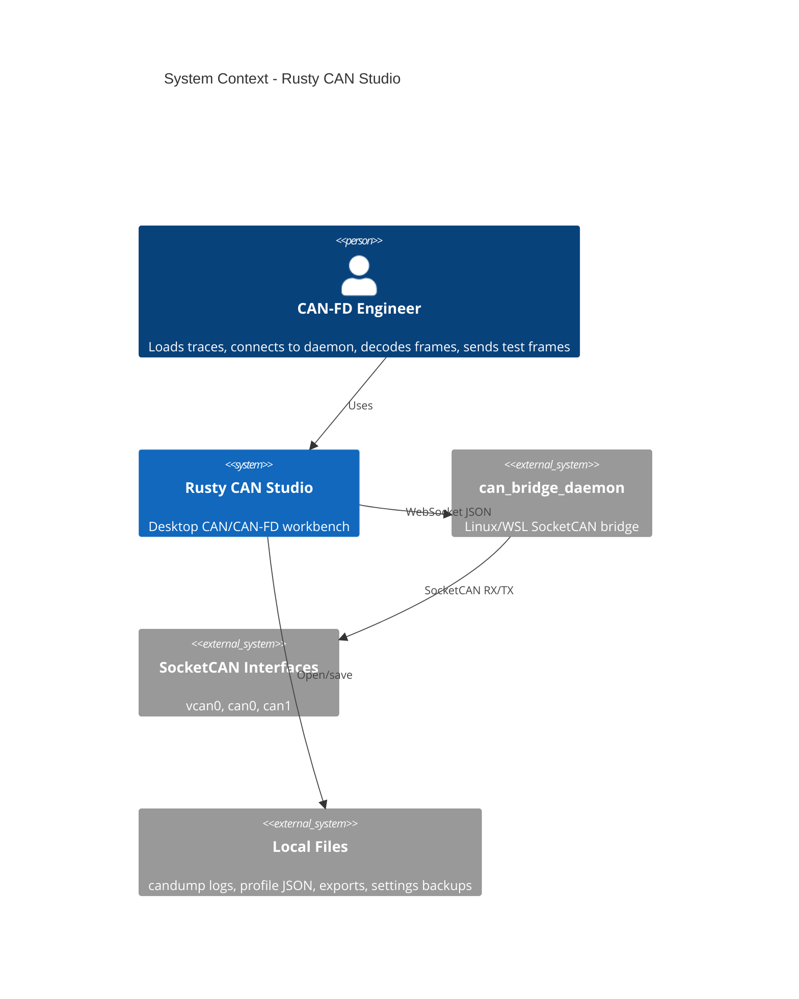

Key external interactions:

- `can_bridge_daemon` - WebSocket JSON for interface discovery, subscription, frames, and transmit acknowledgements.
- SocketCAN interfaces - actual CAN/CAN-FD bus access through Linux/WSL.
- Local files - candump logs, JSON profiles, CSV exports, settings backups, diagnostics, and examples.

### 5.2 Container Diagram

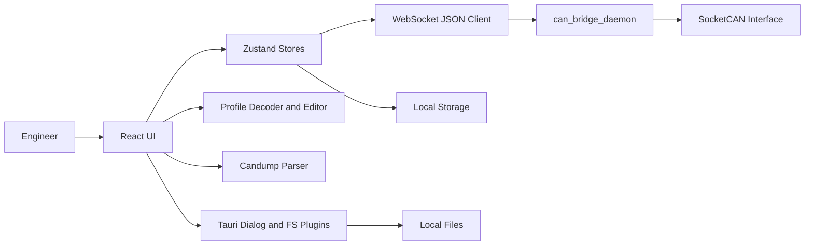

| Container | Technology | Responsibility |
| --- | --- | --- |
| Presentation layer | React, Tailwind, Radix | Screens, tables, dialogs, Help, profile editor. |
| State layer | Zustand | Connection state, frames, preferences, diagnostics, profiles. |
| Transport layer | WebSocket JSON client | Daemon handshake, requests, streaming frames, TX ACKs. |
| Profile layer | TypeScript decoder/editor | JSON profile parsing, matching, decoded output. |
| Native shell | Tauri/Rust | Desktop packaging and filesystem/dialog access. |
| Remote daemon | Rust daemon project | SocketCAN access and network forwarding. |
| Local persistence | localStorage/files | Preferences, traces, settings backup, exports. |

### 5.3 Navigation Architecture

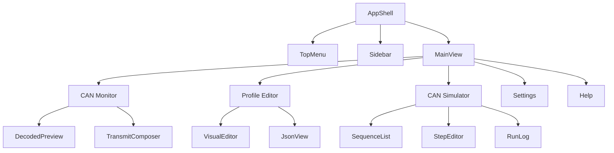

### 5.4 Data Flow Diagram

Critical flow: live frame capture.

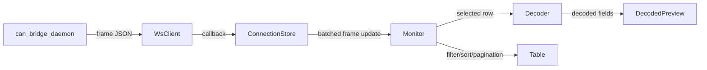

### 5.5 Security Architecture

Authentication and authorization model:

- v1.0 has no user authentication model.
- Remote daemon access is controlled by network reachability and daemon binding configuration.
- The app does not store daemon credentials.
- Any sensitive trace/profile content is treated as local engineering data.
- CI and scripts check for dependency vulnerabilities and common secret patterns.

Data isolation policy:

| Resource | Create | Read | Update | Delete | Enforcement |
| --- | --- | --- | --- | --- | --- |
| Connection profiles | Local user | Local user | Local user | Local user | localStorage in app profile |
| Trace archive | Local user | Local user | Local user | Local user | localStorage and explicit export |
| Profile JSON | Local user | Local user | Local user | Local user | file import/export |
| Diagnostics log | App/local user | Local user | App/local user | Local user | localStorage and UI controls |

Important: Never include private daemon credentials, internal trace files, private keys, or proprietary profile data in source control or shared artifacts.

## 06 Use Cases - Full Catalogue

### 6.1 Use Case Overview

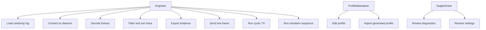

### 6.2 Monitor Use Cases

#### UC-01: Load candump log

| Attribute | Detail |
| --- | --- |
| Actor | CAN-FD engineer, support user |
| Trigger | User selects Open in CAN Monitor |
| Precondition | A candump-compatible file exists |
| Main Flow | Select file, parse rows, load frames, show file name, preserve line numbers |
| Error Cases | Invalid lines ignored; empty result shows no frames |
| Postcondition | Loaded frames are visible and filterable |
| Priority | Must |

#### UC-02: Connect to daemon

| Attribute | Detail |
| --- | --- |
| Actor | CAN-FD engineer |
| Trigger | User selects Save and Connect |
| Precondition | Daemon is reachable and interface exists |
| Main Flow | Build WS URL, connect, handshake, discover/subscribe, stream frames |
| Error Cases | Connection timeout, WebSocket error, no interface, subscribe failure |
| Postcondition | Connection status is connected and frames can stream |
| Priority | Must |

#### UC-03: Filter and sort trace

| Attribute | Detail |
| --- | --- |
| Actor | Engineer |
| Trigger | User types filter or uses column menu |
| Precondition | Trace rows exist |
| Main Flow | Validate filter, apply filter, apply sorting, update visible rows |
| Error Cases | Invalid filter shows error and avoids misleading result |
| Postcondition | Monitor shows matching rows |
| Priority | Must |

### 6.3 Profile Use Cases

#### UC-10: Load profile JSON

| Attribute | Detail |
| --- | --- |
| Actor | Profile maintainer, engineer |
| Trigger | User selects Load Profile JSON |
| Precondition | JSON profile exists |
| Main Flow | Parse canonical JSON, validate the profile, add it to the loaded library, update editor |
| Error Cases | Invalid JSON or schema causes validation error |
| Postcondition | Matching frames decode using loaded profile |
| Priority | Must |

#### UC-11: Edit payload field

| Attribute | Detail |
| --- | --- |
| Actor | Profile maintainer |
| Trigger | User selects field in Visual editor |
| Precondition | Editable profile loaded |
| Main Flow | Change bit layout/type/value map, preview decoded selected frame, save |
| Error Cases | Invalid bit layout warns or blocks save depending validation |
| Postcondition | Profile JSON includes updated field |
| Priority | Should |

### 6.4 Transmit Use Cases

#### UC-20: Send one frame

| Attribute | Detail |
| --- | --- |
| Actor | Engineer |
| Trigger | User selects Send Frame |
| Precondition | Remote daemon connected |
| Main Flow | Insert TX pending row, send frame, receive ACK, update TX row |
| Error Cases | Daemon rejects send or socket closes; row becomes TX failed |
| Postcondition | TX result visible in monitor |
| Priority | Must |

#### UC-21: Run cyclic TX

| Attribute | Detail |
| --- | --- |
| Actor | Integration tester |
| Trigger | User starts cyclic TX |
| Precondition | Valid frame and connection available |
| Main Flow | Send frame repeatedly, optionally wait for ACK or response, enforce timeout policy |
| Error Cases | Missing response, late ACK, send failure |
| Postcondition | Cyclic run stops or continues according to policy |
| Priority | Should |

### 6.5 Simulator Use Cases

#### UC-30: Run sequence

| Attribute | Detail |
| --- | --- |
| Actor | Integration tester |
| Trigger | User selects Run in CAN Simulator |
| Precondition | Sequence exists and daemon connected |
| Main Flow | Execute steps in order, send/wait/cyclic/delay, update run log |
| Error Cases | Timeout, failed send, unmatched response, manual stop |
| Postcondition | Sequence status and logs are visible |
| Priority | Should |

### 6.6 Settings and Documentation Use Cases

#### UC-40: Export settings backup

| Attribute | Detail |
| --- | --- |
| Actor | Engineer |
| Trigger | User selects export settings |
| Precondition | Settings exist in local storage |
| Main Flow | Collect supported keys, create JSON backup, save file |
| Error Cases | File save cancelled or denied |
| Postcondition | Backup file exists |
| Priority | Should |

#### UC-41: Read Help

| Attribute | Detail |
| --- | --- |
| Actor | Any user |
| Trigger | User opens Help |
| Precondition | App is running |
| Main Flow | Render default/custom markdown, search content, navigate ToC |
| Error Cases | Custom markdown can be reset to default |
| Postcondition | User finds workflow guidance |
| Priority | Should |

## 07 Sequence Diagrams

### 7.1 App Cold Start

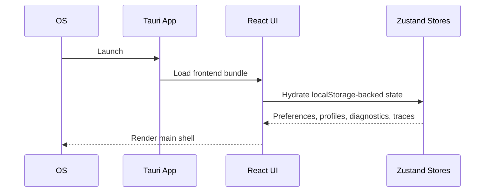

Design decisions illustrated:

- Local state is hydrated without a cloud dependency.
- No authentication gate is required in v1.0.
- Previously saved UI preferences can affect the first render.

### 7.2 Load Candump Log

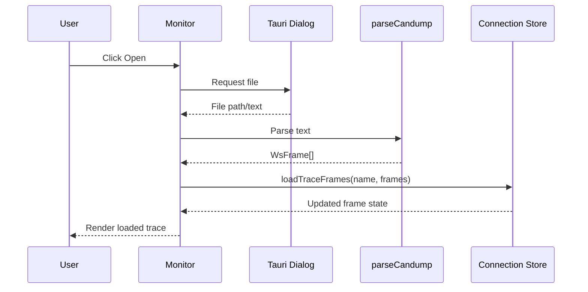

### 7.3 Connect and Subscribe to Daemon

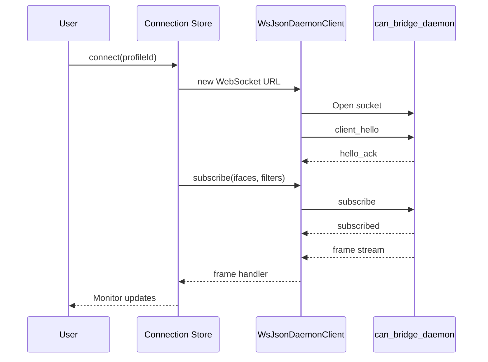

### 7.4 Send Frame with ACK

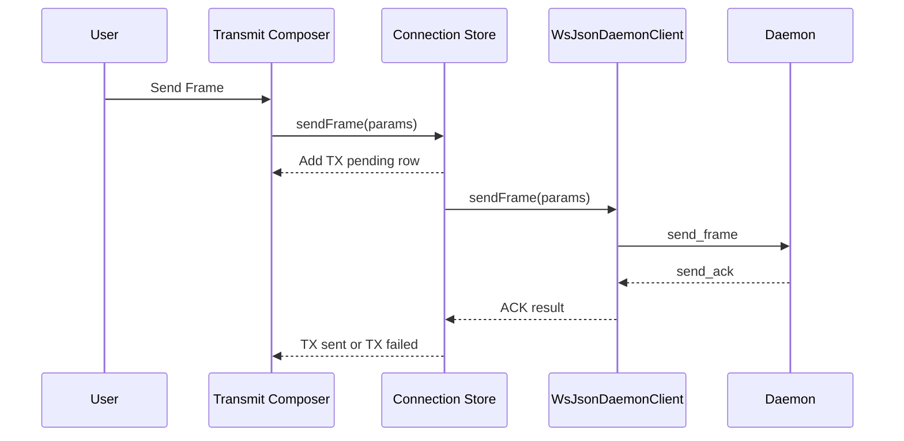

### 7.5 Cyclic TX Waiting for CAN Response

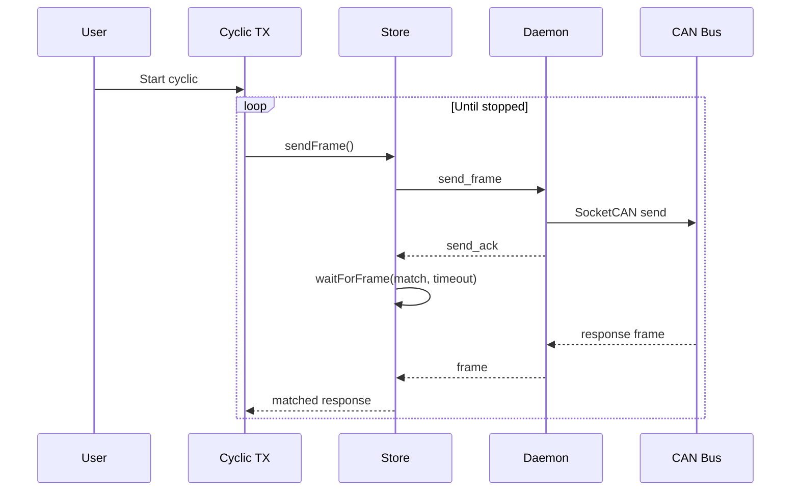

### 7.6 Simulator Sequence

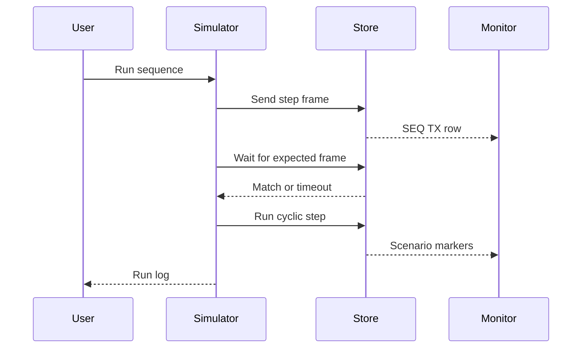

## 08 Database Schema and ERD

### 8.1 Entity Relationship Diagram

Rusty CAN Studio v1.0 does not use a central database. Persistent data is local app state and local files.

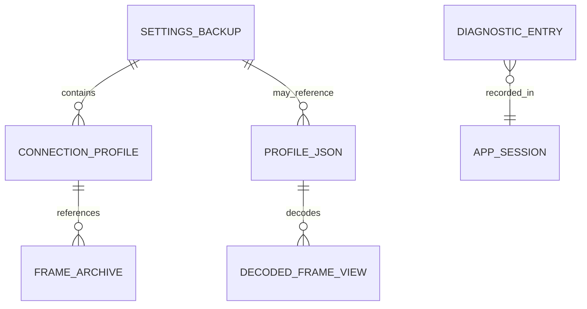

### 8.2 Local Data Definitions

#### 8.2.1 connection_profiles

| Column | Type | Constraints | Description |
| --- | --- | --- | --- |
| id | string | required | Profile identifier. |
| name | string | required | User-facing profile name. |
| mode | string | required | `remote` or `local`. |
| host | string | optional | Daemon host. |
| port | number | optional | Daemon WebSocket port. |
| protocol | string | optional | Current app path uses WebSocket JSON. |
| iface | string | optional | Selected CAN interface. |
| filters | array | optional | Raw daemon-side capture filters. |

#### 8.2.2 trace_archive_entries

| Column | Type | Constraints | Description |
| --- | --- | --- | --- |
| id | string | required | Archive entry identifier. |
| name | string | required | User-facing trace name. |
| candumpText | string | required | Raw candump representation. |
| createdAt | string | required | Creation timestamp. |

#### 8.2.3 profile_json

| Column | Type | Constraints | Description |
| --- | --- | --- | --- |
| schemaVersion | string | required | Canonical profile contract version. |
| meta | object | required | Name, version, source metadata. |
| bus | object | required | CAN/CAN-FD mode, identifier format, and byte order. |
| layouts | object | required | CAN ID layout and optional payload header layout. |
| dictionaries | object | optional | Numeric-to-text dictionaries used by fields. |
| messages | array | required | Message identification rules and payload fields. |
| errors | array | optional | Error extraction and dictionary rules. |
| display | object | optional | Column, editor, and presentation hints. |

#### 8.2.4 diagnostics

| Column | Type | Constraints | Description |
| --- | --- | --- | --- |
| id | string | required | Diagnostic identifier. |
| time | string | required | Event time. |
| level | string | required | info, warning, error, success. |
| source | string | required | Source subsystem. |
| message | string | required | Short event text. |
| detail | string | optional | Longer diagnostic detail. |

### 8.3 Indexes

No database indexes exist in v1.0. In-memory filtering and sorting operate on retained frame arrays.

### 8.4 Stored Procedures and Functions

No database stored procedures exist in v1.0.

### 8.5 Data Retention and Migration Policy

- Local settings and profiles are retained until the user clears app data or imports/restores new settings.
- Diagnostics are capped to recent entries.
- Historical traces are capped by app policy.
- Source profile JSON files and exported traces are retained according to the user's file-system practices.
- Future migrations should version localStorage keys and preserve backward-compatible import where practical.

## 09 State Machine Diagrams

### 9.1 Connection State

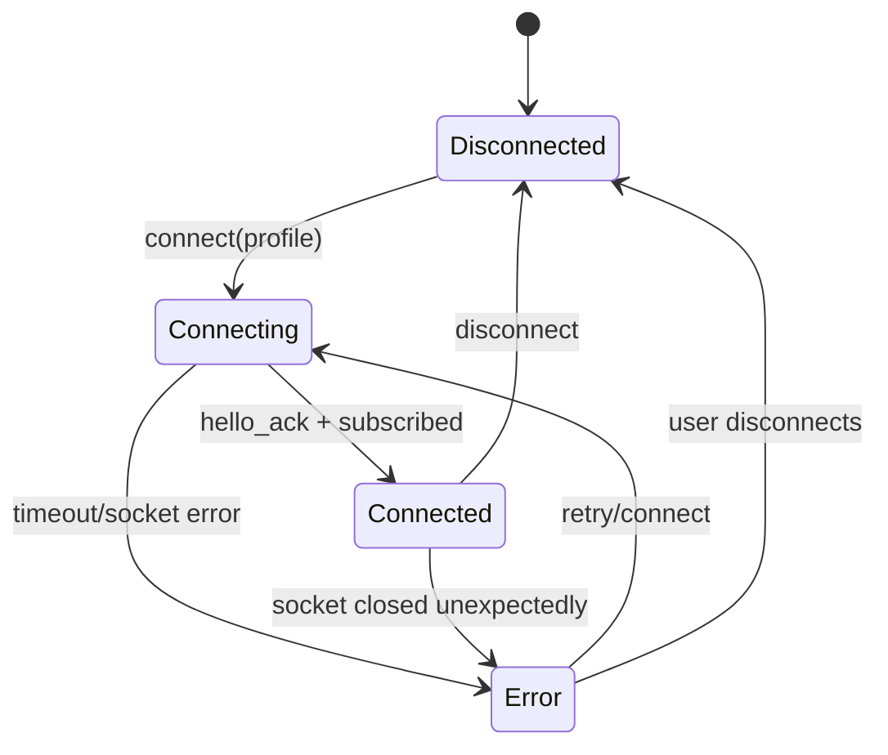

### 9.2 Live Capture State

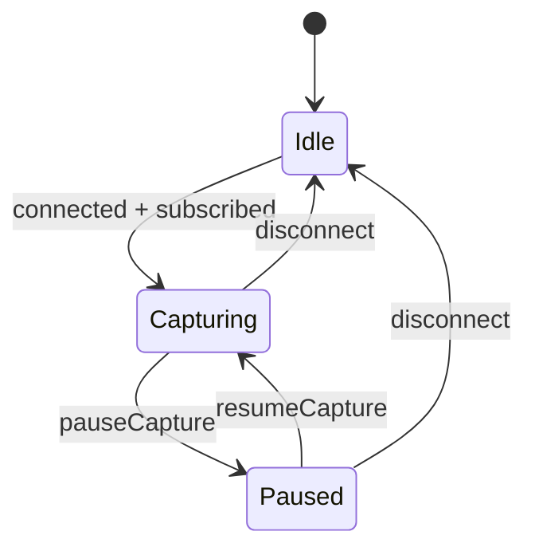

### 9.3 Transmit Frame State

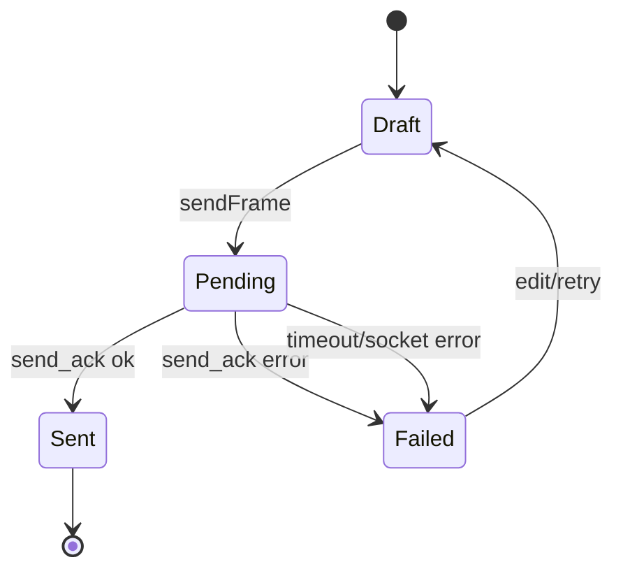

### 9.4 Simulator Sequence State

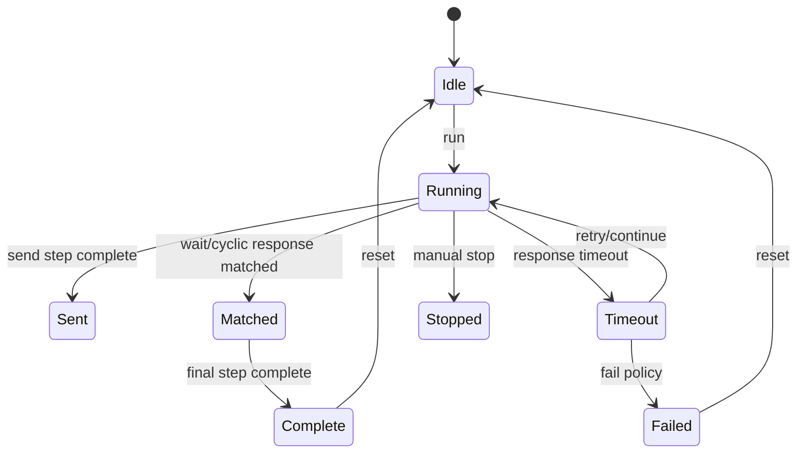

## 10 Screen Designs and UI/UX

### 10.1 Design System and Tokens

Color tokens are CSS custom properties driven by the theme system.

| Token Name | Light Mode Value | Dark Mode Value | Usage |
| --- | --- | --- | --- |
| background | theme variable | theme variable | Main page background. |
| foreground | theme variable | theme variable | Primary text. |
| muted | theme variable | theme variable | Secondary surfaces. |
| primary | theme variable | theme variable | Primary actions and emphasis. |
| destructive | theme variable | theme variable | Errors and destructive actions. |
| border | theme variable | theme variable | Panel and table separation. |
| ring | theme variable | theme variable | Focus outlines. |

Typography:

| Style | Font | Size | Weight | Usage |
| --- | --- | --- | --- | --- |
| Screen title | System UI | 18-24 px | 600 | Main pane headings. |
| Section heading | System UI | 13-16 px | 600 | Panels and cards. |
| Body | System UI | 12-14 px | 400 | Normal controls and text. |
| Trace mono | Monospace | 11-13 px | 400/600 | CAN IDs, payloads, filters. |
| Caption | System UI | 10-12 px | 400/500 | Metadata, badges, status text. |

### 10.2 Themes

| Theme Name | Mode | Background | Accent | Key Visual Character |
| --- | --- | --- | --- | --- |
| Default | Light/Dark | Neutral | Balanced accent | General-purpose engineering UI. |
| Graphite | Light/Dark | Neutral gray | Muted accent | Quiet, low-noise long sessions. |
| Zeiss Blue | Light/Dark | Professional blue-neutral | Blue | Enterprise/lab-oriented. |
| High Contrast | Light/Dark | Strong contrast | High visibility | Accessibility-oriented. |
| Terminal Trace | Dark | Dark log surface | Terminal-style accent | Trace-heavy sessions. |
| Warm Neutral | Light/Dark | Soft neutral | Warm accent | Lower visual harshness. |

### 10.3 Screen Inventory

| Screen | Route / Stack | Navigator Type | Description |
| --- | --- | --- | --- |
| CAN Monitor | MainView monitor | Sidebar/main view | Trace table, filters, decoded preview, TX composer. |
| Profile Editor | MainView profile | Sidebar/main view | Profile loading, visual editing, JSON editing, preview. |
| CAN Simulator | MainView simulator | Sidebar/main view | Sequence list, step editor, run log. |
| Settings | MainView settings | Sidebar/main view | Appearance, localization, diagnostics, backups, traces. |
| Help | MainView help | Sidebar/main view | Markdown help, search, ToC, editor/diff. |
| Connection Dialog | Modal | Dialog | Create/edit/connect remote daemon profiles. |
| Command Palette | Modal | Dialog/command list | Quick actions and shortcuts. |

### 10.4 Screen Specifications

#### 10.4.1 CAN Monitor

| Component / Section | Content / Data Source | Behavior / Interactions |
| --- | --- | --- |
| Toolbar | Connection state, open, export, connect, clear, panel toggles | Runs primary monitor actions. |
| Display filter | User filter string and presets | Validates, debounces, filters rows. |
| Trace table | Frames from connection store | Virtualized rows, sticky headers, context menus. |
| Decoded Preview | Selected frame and loaded profiles | Shows decoded CAN ID/header/payload/error fields. |
| Transmit Composer | Draft frame and active connection | Sends one frame or cyclic TX. |
| Pagination | Loaded logs only | First, previous, next, last, rows per page. |

#### 10.4.2 Profile Editor

| Component / Section | Content / Data Source | Behavior / Interactions |
| --- | --- | --- |
| Toolbar | Loaded profiles and file actions | Load, unload, save/import JSON. |
| Outline | Profile service, header, attributes, operations, variants | Navigate and select editable definition. |
| Definition editor | Selected JSON concept | Edit fields and operations. |
| JSON view | Source profile JSON | Direct raw profile editing. |
| Decoded preview | Selected frame/profile | Validate decode output. |

#### 10.4.3 CAN Simulator

| Component / Section | Content / Data Source | Behavior / Interactions |
| --- | --- | --- |
| Sequence list | Saved sequence definitions | Select, duplicate, delete, load/save JSON. |
| Step timeline | Steps in selected sequence | Add, remove, select. |
| Step editor | Selected step | Configure send/wait/cyclic/delay/branch parameters. |
| Run log | Sequence execution events | Persists across view switches. |
| Connection controls | Shared connection state | Open connection dialog and inspect status. |

#### 10.4.4 Settings

| Component / Section | Content / Data Source | Behavior / Interactions |
| --- | --- | --- |
| Appearance | Theme, mode, density | Applies immediately and persists. |
| Localization | Locale and direction | Updates selected UI labels and formatting. |
| Diagnostics | Local diagnostics log | Export or clear. |
| Historical traces | Saved candump snapshots | Load, export, delete. |
| Backup/restore | Selected local settings | Export/import JSON backup. |

## 11 Complete Project Setup

### 11.1 Prerequisites

| Tool | Required Version | Install Command / Link | Verify Command |
| --- | --- | --- | --- |
| Node.js | Current LTS compatible with Vite/Tauri | Node installer or nvm | `node --version` |
| npm | Bundled with Node | Bundled | `npm --version` |
| Rust | Stable | rustup | `cargo --version` |
| Tauri prerequisites | Tauri 2 platform dependencies | Tauri docs | `npm run tauri -- --version` |
| Linux/WSL for daemon | WSL2 or Linux | OS package manager | `uname -a` |
| protobuf compiler for daemon | distro package | `sudo apt install protobuf-compiler` | `protoc --version` |

### 11.2 Backend / Cloud Setup

No cloud backend is required for v1.0.

Daemon setup:

1. Clone/build `can_bridge_daemon` in Linux or WSL.
2. Ensure Rust and `protoc` are installed.
3. Create or bring up SocketCAN interfaces.
4. Run daemon with WebSocket JSON enabled.
5. Connect from Rusty CAN Studio.

### 11.3 Project Initialisation

```bash
npm install
```

### 11.4 Environment Configuration

| Variable | Description | Where to Get It | Scope |
| --- | --- | --- | --- |
| None required | v1.0 has no required environment variables | Not applicable | Not applicable |

Do not commit secrets or private trace/profile data.

### 11.5 Directory Structure

```text
src/
  app/                 Main app views and workflow screens
  can/                 candump parser and CAN helpers
  can-bridge/          WebSocket daemon client and protocol types
  commands/            Command palette and shortcuts
  components/          Shared UI and help system
  editor/              Older editor helpers and CAN ID utilities
  profile-editor/      Profile model, editor, decoder, validation
  store/               Zustand stores
  utils/               Shared utilities
src-tauri/
  src/                 Tauri Rust code
  capabilities/        Tauri capability files
  permissions/         Tauri permission files
profiles/             Example profile JSON
examples/             Sample candump and sequence JSON
scripts/              Setup, audit, quality, conversion scripts
docs/                 User, developer, examples, testing, security docs
```

### 11.6 Configuration Files

| File | Purpose |
| --- | --- |
| `package.json` | npm scripts, dependencies, browser targets. |
| `vite.config.ts` | Vite, React, PWA, aliases, dev server. |
| `tsconfig.json` | TypeScript strict settings and source includes/excludes. |
| `tailwind.config.cjs` | Tailwind configuration. |
| `src-tauri/tauri.conf.json` | Tauri app, window, bundle, and build config. |
| `.github/workflows/quality.yml` | CI quality workflow. |
| `.github/workflows/security.yml` | CI security workflow. |

### 11.7 Build and Release

```bash
npm run dev
npm run build
npm run tauri dev
npm run tauri build
npm run tauri build -- --bundles msi
```

### 11.8 CI/CD Pipeline

Quality workflow:

1. checkout
2. setup Node
3. setup Rust
4. install Linux Tauri dependencies
5. `npm ci`
6. `npm run test`
7. `npm run build`
8. `npm run accessibility:check`
9. `npm run browser:check`
10. `cargo check`

Security workflow:

1. `npm audit --audit-level=moderate`
2. unit tests
3. production build
4. Rust `cargo audit`

### 11.9 Setup Checklist

| Phase | Item | Done? |
| --- | --- | --- |
| Prerequisites | Node installed and verified | No |
| Prerequisites | Rust installed and verified | No |
| Prerequisites | Tauri prerequisites installed | No |
| Project | `npm install` completed | No |
| Project | `npm run build` passes | No |
| Project | `npm run tauri dev` launches | No |
| Daemon | `can_bridge_daemon` builds | No |
| Daemon | SocketCAN interface exists | No |
| Daemon | WebSocket JSON endpoint runs | No |
| Verify | Connect dialog reaches daemon | No |
| Verify | Candump file loads | No |
| Verify | Profile JSON decodes known frame | No |
| Verify | `npm run quality:check` passes | No |

## 12 Full Implementation Guide

### 12.1 WebSocket Client Initialisation

```ts
import { WsJsonDaemonClient } from "@/can-bridge/ws/WsJsonDaemonClient";

const client = new WsJsonDaemonClient("ws://127.0.0.1:9501/ws/text");
const hello = await client.connect({ clientName: "rusty-can-studio" });
client.setFrameHandler((frame) => {
  // append frame to connection store
});
```

### 12.2 State Store Configuration

Use Zustand stores under `src/store/`. The connection store owns live transport state and frame retention. UI preferences, diagnostics, trace archive, command palette, and monitor preferences are separated into focused stores.

### 12.3 Connection Store Module

Core actions:

```ts
connect(id)
discoverRemoteIfaces(profile)
disconnect()
pauseCapture()
resumeCapture()
clearFrames()
loadTraceFrames(name, frames)
sendFrame(params)
waitForFrame(matches, timeoutMs)
annotateFrame(matches, metadata)
setTraceFrameLimit(limit)
```

Implementation notes:

- Batch live frames before state updates.
- Assign monotonically increasing line numbers for live frames.
- Preserve existing `line_no` from loaded candump rows.
- Keep response waiters timeout-based.

### 12.4 Profile Decoder Module

Decoder inputs:

- `WsFrame`
- loaded canonical profiles
- canonical profile fixtures under `profiles/test/`

Decoder outputs:

- decoded CAN ID fields
- payload header fields
- payload value fields
- message/profile names
- error code/text
- row highlight flags

Implementation rule: only decode message-specific payload fields after profile matching succeeds.

### 12.5 Candump Parser

```ts
import { parseCandump } from "@/can/candump";

const frames = parseCandump(text);
```

The parser ignores invalid lines and returns `WsFrame[]`.

### 12.6 Transmit Service Pattern

Use `connectionStore.sendFrame()` rather than calling the WebSocket client from UI components. This keeps monitor TX rows, ACK state, diagnostics, and sequence metadata consistent.

### 12.7 Simulator Sequence Pattern

Sequence steps are JSON objects with `type`, optional frame fields, and optional wait/stop policies.

Supported step types:

- `send`
- `wait`
- `cyclic`
- `delay`
- `branch`

### 12.8 Help Content

Update `src/components/help-system/defaultHelpMarkdown.ts` whenever user-facing behavior changes.

Callout syntax:

```markdown
:::note
Neutral information.
:::

:::tip
Workflow advice.
:::

:::warning
Risky or recoverable issue.
:::

:::danger
Safety-critical issue.
:::
```

### 12.9 Quality Scripts

```bash
npm run test
npm run build
npm run quality:check
```

For performance-sensitive changes:

```bash
npm run benchmark
```

For security:

```bash
npm run security:audit
```

### 12.10 Troubleshooting Reference

| Error / Symptom | Root Cause | Fix |
| --- | --- | --- |
| `cargo: command not found` | Rust not installed or shell not sourced | Install Rust and source cargo env. |
| `Could not find protoc` | protobuf compiler missing for daemon build | Install `protobuf-compiler`. |
| Live capture empty | Daemon not running, wrong host/port/interface, or filter excludes frames | Verify daemon, interface, connection profile, filters. |
| `TX:sent` but no response | Daemon accepted send but target did not respond | Use Wait for CAN response and check interface/filter. |
| Profile fields missing | Wrong profile loaded or service/header does not match frame | Load the matching canonical profile and inspect the frame identity fields. |
| Browser check fails on user-agent | Browser-specific sniffing added | Replace with feature/platform capability checks. |

## 13 Architecture Decisions

### ADR-001: Tauri + React Desktop Architecture

| Attribute | Detail |
| --- | --- |
| Status | Accepted |
| Date | 2026-07-13 |
| Decision | Use Tauri 2 with React/TypeScript frontend and Rust shell. |
| Context | The app needs desktop file dialogs, packaging, and a rich frontend UI. |
| Rationale | Tauri keeps native packaging lightweight while allowing fast React UI development. |
| Trade-offs | WebView behavior must be tested across platforms; native CAN access is not automatic on Windows. |
| Rejected alternatives | Electron: heavier runtime. Native-only UI: slower iteration. |
| Consequences | Build requires Node, Rust, and Tauri prerequisites. |

### ADR-002: Remote Daemon for SocketCAN

| Attribute | Detail |
| --- | --- |
| Status | Accepted |
| Date | 2026-07-13 |
| Decision | Use `can_bridge_daemon` for live SocketCAN access from Windows/Linux clients. |
| Context | Windows does not provide Linux SocketCAN natively. |
| Rationale | Keeps CAN interface access where SocketCAN exists and lets desktop app remain a client. |
| Trade-offs | Requires daemon deployment and network reachability. |
| Rejected alternatives | Direct Windows CAN drivers in v1.0; protocol-specific hardware integrations. |
| Consequences | Connection UX centers on Remote Daemon profiles. |

### ADR-003: JSON Profiles as Runtime Decode Source

| Attribute | Detail |
| --- | --- |
| Status | Accepted |
| Date | 2026-07-13 |
| Decision | Use JSON profiles as the runtime decode configuration. |
| Context | Source schemas can originate from XML, hand-authored JSON, or other formats. |
| Rationale | Keeps runtime generic and avoids hardcoded protocol meaning. |
| Trade-offs | Profile validation and editing UX must be strong. |
| Rejected alternatives | XML as runtime format; hardcoded decoder. |
| Consequences | Converter scripts generate JSON; editor edits JSON source. |

### ADR-004: Zustand for App State

| Attribute | Detail |
| --- | --- |
| Status | Accepted |
| Date | 2026-07-13 |
| Decision | Use Zustand stores for app state. |
| Context | The app needs focused local state without a heavy server-state framework. |
| Rationale | Small API, simple persistence, suitable for local desktop app. |
| Trade-offs | Store boundaries must be maintained manually. |
| Rejected alternatives | Redux Toolkit for all state; React context only. |
| Consequences | Domain stores own persistence and actions. |

### ADR-005: Local-First Storage

| Attribute | Detail |
| --- | --- |
| Status | Accepted |
| Date | 2026-07-13 |
| Decision | Store preferences, diagnostics, traces, and profiles locally. |
| Context | The app is an engineering workstation tool, not a cloud collaboration product. |
| Rationale | Works offline and avoids backend setup. |
| Trade-offs | No cross-device sync in v1.0. |
| Rejected alternatives | Cloud backend with auth and database. |
| Consequences | Exports/backups are important for sharing state. |

### ADR-006: Baseline Quality Scripts Instead of Heavy E2E in v1.0

| Attribute | Detail |
| --- | --- |
| Status | Accepted |
| Date | 2026-07-13 |
| Decision | Use unit tests, build, audits, accessibility baseline, browser baseline, Rust check, and benchmarks for v1.0 quality gates. |
| Context | The product is still evolving rapidly and needs practical gates. |
| Rationale | Catches common regressions without slowing every change. |
| Trade-offs | Does not replace full visual regression, WCAG audit, or E2E automation. |
| Rejected alternatives | Full Playwright/E2E suite before UI stabilizes. |
| Consequences | Future releases should add E2E coverage for critical flows. |

## 14 Quality, Risks and Technical Debt

### 14.1 Quality Scenarios

| Quality Attribute | Scenario / Stimulus | Expected Response | Test Method |
| --- | --- | --- | --- |
| Performance | User loads 50k frame candump | Trace loads and remains filterable | Benchmark + manual test |
| Reliability | Daemon disconnects during live capture | Connection state changes to error/disconnected | Manual daemon stop test |
| Security | Repo contains accidental token pattern | Security script fails | `npm run security:audit` |
| Usability | New user loads first trace | User guide and examples enable workflow without developer help | User walkthrough |
| Maintainability | New daemon message is added | Type added in `types.ts`, client method added, Help/docs updated | Code review |
| Accessibility | Icon-only button added | Accessible name exists | `npm run accessibility:check` |

### 14.2 Performance Budget

| Metric | Target | Current Baseline | Measurement Tool |
| --- | --- | --- | --- |
| 10k candump parse | < 20 ms local baseline | about 8 ms | `npm run benchmark` |
| 50k candump parse | < 80 ms local baseline | about 45 ms | `npm run benchmark` |
| Canonical profile decoding | Track and improve local baseline | measured by benchmark run | `npm run benchmark` |
| Production JS bundle | Track and reduce over time | about 1.13 MB minified main chunk | `npm run build` |
| Unit test suite | < 5 s local | < 1 s typical | `npm run test` |

### 14.3 Risk Register

| ID | Risk Description | Likelihood | Impact | Mitigation Strategy | Owner |
| --- | --- | --- | --- | --- | --- |
| R-01 | Daemon unavailable or misconfigured | Medium | High | Clear connection states, diagnostics, daemon docs | Engineering |
| R-02 | Wrong profile decodes unrelated frames | Medium | High | Conservative matching, tests, user docs | Engineering |
| R-03 | Physical bus disturbed by incorrect TX | Low | Critical | Safety warnings, explicit user action, TX status | Product/Engineering |
| R-04 | Large trace causes UI slowdown | Medium | High | Virtualization, batching, pagination, benchmarks | Engineering |
| R-05 | Sensitive trace/profile data shared accidentally | Medium | High | Security docs, export warnings, diagnostics review | Users/Security |
| R-06 | Browser/WebView compatibility regression | Medium | Medium | Browser baseline and build checks | Engineering |
| R-07 | Dependency vulnerability | Medium | High | npm audit, cargo audit in CI | Engineering |

### 14.4 Technical Debt Register

| ID | Description | Severity | Impact if Left | Planned Fix | Target Version |
| --- | --- | --- | --- | --- | --- |
| TD-01 | No full E2E automation for monitor/profile/TX flows | High | Manual regression risk | Add Playwright or Tauri E2E smoke tests | v1.1 |
| TD-02 | Large main JS bundle | Medium | Slower load and WebView memory pressure | Code-split heavy editors/help/simulator | v1.1 |
| TD-03 | Browser/accessibility checks are baseline only | Medium | Some UX issues may escape automation | Add richer automated and manual checklist | v1.1 |
| TD-04 | Limited end-to-end automation for canonical profile editing | Medium | Manual regression risk for complex profile UI flows | Add UI smoke tests for profile import, visual editing, and monitor decode | v1.2 |
| TD-05 | No cloud sync for settings/profiles | Low | Manual backup/restore required | Reassess if collaboration becomes a requirement | v2.0 |

### 14.5 Glossary

| Term | Definition |
| --- | --- |
| ADR | Architecture Decision Record; documents a significant technical choice. |
| CAN | Controller Area Network. |
| CAN-FD | CAN Flexible Data-rate; CAN variant with larger payloads and optional faster data phase. |
| Candump | Common text log format produced by SocketCAN tooling. |
| SocketCAN | Linux CAN networking stack. |
| Tauri | Desktop app framework using a WebView frontend and Rust backend shell. |
| WebSocket JSON | Text JSON protocol used between the app and daemon. |
| Profile JSON | Runtime decode configuration for CAN ID and payload fields. |
| Payload header | Shared payload bytes used to route/decode a message. |
| TX ACK | Daemon acknowledgement that a frame send call was accepted or rejected. |
| Sequence | CAN Simulator workflow made of send/wait/cyclic/delay/branch steps. |

### 14.6 Document Revision History

| Version | Date | Author | Changes |
| --- | --- | --- | --- |
| 1.0 | 2026-07-13 | Rusty CAN Studio Team | Initial product and engineering reference. |
